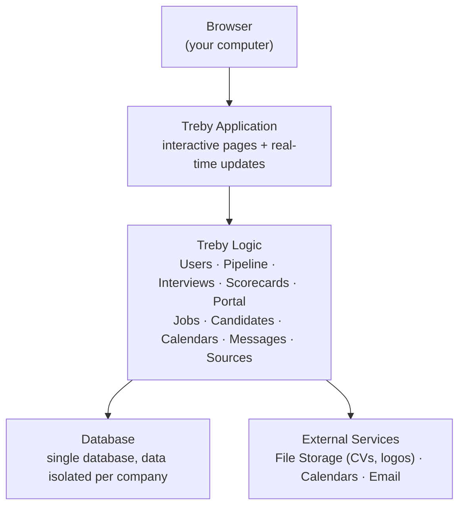
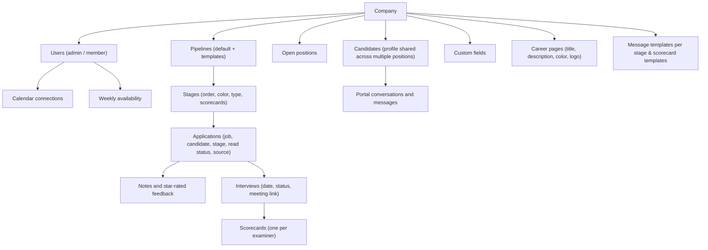

# How Treby Works

## Overview

Treby is a web application where each company (tenant) has fully isolated data. A company sees only its own jobs, candidates, and pipelines.

All pages are interactive and update without reloading the browser. When someone moves a candidate in the pipeline, every teammate sees the move in real time.

## Key Concepts

### Isolated Companies (Multi-Tenant)

Each registered company has a separate workspace. Data from Acme is never visible to another company and vice versa. Isolation is enforced at the database level.

The same person can belong to multiple companies with a single email and password: each membership has its own role (Admin in one, Member in another) and the app shows only the data for the selected company.

You can create multiple pipelines for the same company: each job can use the default pipeline or a dedicated pipeline with different stages.

### Pipelines and Stages

A pipeline is the sequence of stages a candidate goes through (e.g., New → Screening → Interview → Offer → Hired → Rejected). Each stage has a color, an order, and may have a type (e.g., interview stage) that enables specific rules such as scorecards.

Pipelines are configurable: you can rename stages, change colors, reorder them, or create new ones. You can also save a pipeline as a template to reuse it for other jobs.

### Stage Roles

Each stage can have three assignment types:

- **Examiners** — who runs the interviews and fills out scorecards
- **Reviewers** — who reviews applications
- **Advancers** — who can move or reject candidates in that stage

Only advancers can advance or reject candidates. This lets a team collaborate without everyone having final decision power.

### Authentication

- **Internal team** (admins and members): sign in with email and password. The same email can belong to multiple companies with different roles; at login, anyone with multiple workspaces sees **Choose workspace** and can switch companies from the header without signing out. Admins manage settings, pipelines, and invitations; members use the pipeline and interviews according to their assigned permissions.
- **Candidates**: no password account. Candidates enter their email, receive a 6-digit code valid for 10 minutes, and use that code to enter the portal. The session lasts a few hours and can be ended explicitly.

### Candidate Portal

The portal is the only place where real content lives: messages, stage updates, interview details. Email only sends a short notification ("you have a new message, go to the portal") with a link — never the actual content.

### Files and Calendars

- CVs and logos are stored on S3-compatible storage (a local service in development, any S3 provider in production).
- Each member sets their own weekly availability windows. If you connect Google Calendar, Treby intersects your internal windows with your real commitments to propose only free slots.
- Interview meeting links are created automatically: Google Meet if at least one examiner has Google connected, otherwise Jitsi.

### Scheduled Messages

You can send a message immediately or schedule it for later. Scheduled messages have a dedicated queue, support random jitter, and automatic retries on failure.

## What Treby Uses (Technical Overview — Not Needed for Daily Use)

Treby is built with Phoenix LiveView, a PostgreSQL database, S3 storage, email via Swoosh, real-time updates, and background jobs for scheduled messages. You don't need to know the implementation details to use the application: just know it's a standard web app that runs in the browser and stores data in a database.

## Simplified Data Model

## Integrations

Treby can push key events — a candidate created, an application changing stage, an interview scheduled, and more — to external systems you configure. Admins subscribe an HTTPS endpoint to the events they choose, and Treby delivers a signed JSON payload for each one, with automatic retries. This lets Treby connect to automation tools, HRIS platforms, job boards, or your own services without code changes.

## Navigation Flow

1. Public pages: home, careers (`/careers` and `/:company/careers`), login and registration.
2. Workspace picker (`/choose-tenant`): after login, anyone belonging to multiple companies picks a workspace; those with one go directly to `/:company/app`.
3. Team area (`/:company/app/*`): dashboard, jobs, candidates, pipeline, analytics, interviews — requires login and workspace membership. The header shows the workspace switcher when you belong to multiple companies. Old `/app/*` links keep working.
4. Settings (`/:company/app/settings/*`): reserved for workspace admins — pipelines, branding, team, custom fields, sources, templates.
5. Candidate portal (`/:company/portal/*`): email code login, then messages, interview scheduling, and notification settings. Separate from team authentication.
